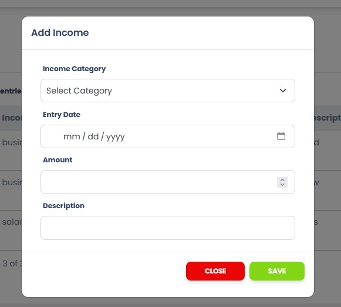

## Income Expense Tracker Application
<blockquote>
This is a simple web-based open-source Income Expense Tracker Application. Where User can track finance calculation
</blockquote>

## Features of Event Management System
<ul>
    <li>Home Page</li>
    <li>Income List</li>
    <li>Add Income</li>
    <li>Expense List</li>
    <li>Add Expense</li>
    <li>User Profile</li>
    <li>Login System</li>
    <li>Registration System</li>
    <li>User Profile</li>
    <li>Password Reset</li>
    <li>Dashboard Overview</li>
    
</ul>

## Technology
<ul>
    <li>PHP</li>
    <li>Laravel</li>
    <li>MySQL</li>
    <li>JavaScript</li>
    <li>Axios</li>
    <li>HTML</li>
    <li>CSS</li>
    <li>Bootstrap</li>
</ul>

## ScreenShot of this project

## Home Page or Overview
<table>
    <thead>
        <tr>
            <th>
                
            </th>
        </tr>
    </thead>
</table>

## Income List
<table>
    <thead>
        <tr>
            <th>
                
            </th>
        </tr>
    </thead>
</table>

## Add Income 
<table>
    <thead>
        <tr>
            <th>
                
            </th>
        </tr>
    </thead>
</table>

## Expense List
<table>
    <thead>
        <tr>
            <th>
                
            </th>
        </tr>
    </thead>
</table>

## Add Income
<table>
    <thead>
        <tr>
            <th>
                
            </th>
        </tr>
    </thead>
</table>

## Login Page
<table>
    <thead>
        <tr>
            <th>
                
            </th>
        </tr>
    </thead>
</table>

## Registration Page
<table>
    <thead>
        <tr>
            <th>
                
            </th>
        </tr>
    </thead>
</table>

